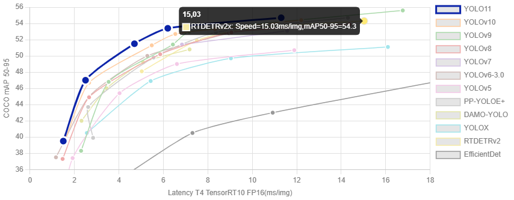

# CONCEALED OBJECTS DETECTION VIA TERAHERTZ IMAGING
---

## Project Overview

This project focuses on detecting concealed objects using terahertz imaging and state-of-the-art deep learning techniques. Leveraging the YOLOv8 architecture, we aim to provide accurate and efficient object detection suitable for security and screening applications.

## Using Yolov8 [object detection](https://docs.ultralytics.com/models/yolov8/)

YOLOv8 was released by Ultralytics on January 10th, 2023, offering cutting-edge performance in terms of accuracy and speed. Building upon the advancements of previous YOLO versions, YOLOv8 introduced new features and optimizations that make it an ideal choice for various object detection tasks in a wide range of applications.

## Performance Metrics: Comparison Across Popular Models




We do not have access to a GPU locally, so model training will be performed using the CPU.
---

| Accelerator    | Typical Usage                                         | Performance                  |
| -------------- | ----------------------------------------------------- | ---------------------------- |
| **CPU**        | Basic, no GPU available                               | Slow                         |
| **T4 GPU**     | Light deep learning (YOLOv5/v8, classification)       | correct                      |
| **A100 GPU**   | Very powerful (intensive training, LLMs)              | Excellent                    |
| **L4 GPU**     | Optimized for AI (efficient for vision + text tasks)  | Very good                    |
| **TPU v2-v6e** | Specialized for TensorFlow (less flexible)            | Very fast, but specific      |


### Features

- **Terahertz Imaging Dataset**: Utilizes specialized imaging for enhanced detection of concealed items.
- **YOLOv8 Integration**: Employs Ultralytics YOLOv8 for robust object detection.
- **Colab Support**: Easily run experiments on Google Colab with GPU acceleration.
- **Performance Comparison**: Benchmarks across various hardware accelerators.

## Getting Started

### Prerequisites

- Python 3.8+
- [Ultralytics YOLOv8](https://github.com/ultralytics/ultralytics)
- Google Colab (for GPU support)

### Installation

Clone the repository:
```bash
git clone https://github.com/donat-konan33/ClassificationWithTransferlearning.git
cd ClassificationWithTransferlearning
```

Install dependencies:

First, install Poetry, a package manager:
```bash
pipx install poetry
```
If ``pipx`` is not already installed, check [here](https://pipx.pypa.io/stable/installation/) for more information.

Then:

```
poetry install
```

### Running on Google Colab (Optional but recommended for reducing training latency)

1. Open the project in [Google Colab](https://colab.research.google.com/).
2. Upload your dataset or mount Google Drive.
3. Run the provided notebooks for training and evaluation.

### Running onto local Machine with CPU if you have no choice
**Note:** Training the model on a CPU can be very time-consuming. Please be prepared for longer training durations when not using GPU resources.

## Results
- Achieved high accuracy in detecting concealed objects using terahertz imaging.
- Model training required significant time, taking approximately 8.28 hours on CPU.
- Find more by reading [model training notebook](notebooks/3_model_training.ipynb)

## Improvements
To reduce computation time while preserving prediction accuracy, consider the following strategies:
- Utilize GPU resources, such as those available through Google Colab, to accelerate training.
- Apply optimization methods like image size or dimensionality reduction (e.g., using Principal Component Analysis, PCA).
- Restrict transfer learning to the convolutional layers of the YOLO architecture.

## Contributing

Contributions are welcome! Please open issues or submit pull requests for improvements.

---
## Citations and Acknowledgements
@software{yolov8_ultralytics,
  author = {Glenn Jocher and Ayush Chaurasia and Jing Qiu},
  title = {Ultralytics YOLOv8},
  version = {8.0.0},
  year = {2023},
  url = {https://github.com/ultralytics/ultralytics},
  orcid = {0000-0001-5950-6979, 0000-0002-7603-6750, 0000-0003-3783-7069},
  license = {AGPL-3.0}
}
